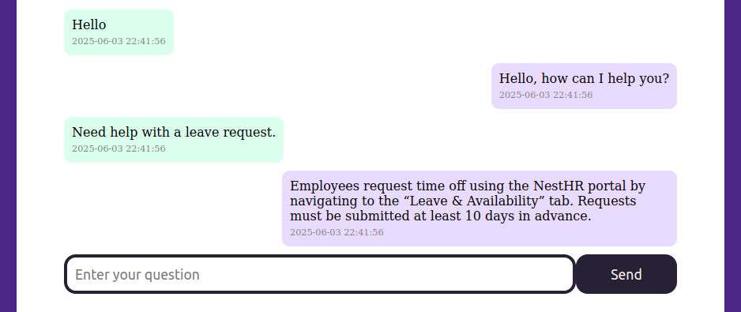

# Simple-RAG-chatbot



## Table of Contents

1. [About](#about)
2. [Prerequisites](#prerequisites)
3. [Installation](#installation)
4. [Usage](#usage)
5. [How it works](#how-it-works)
    - [APIs & Functionality](#functionality)
    - [Database Simulation](#database)
    - [RAG Retrieval](#retrieval-augmented-generation)
    - [Language Model Integration](#language-model-integration)
    - [Modular Design](#modular-design)
6. [Limitations & Trade-Offs](#limitations--trade-offs)
7. [Development](#development)
    - [Testing](#testing)

## About

FastAPI backend with server-side rendered UI (Jinja2 templates) and contextual retrieval (RAG) for an AI assistant.

An end-to-end FastAPI application integrating a server-rendered interface with a retrieval-augmented AI system (RAG), demonstrating practical experience in Python backend development and applied AI/ML systems design.

## Prerequisites

Make sure you have `uv` (Python package manager) installed before proceeding.  

```bash
uv --version
```

If you don't have `uv` installed, you can install it with:  
https://github.com/astral-sh/uv

## Installation

#### 1. Clone the repository
```bash
git clone https://github.com/wandperson/simple-rag-chatbot.git
cd simple-rag-chatbot
```

#### 2. Install dependencies
```bash
uv sync --frozen
```

#### 3. Activate virtual environment
```bash
source .venv/bin/activate
```

## Usage

**Start the FastAPI Server**
```bash
uvicorn main:app
```
The Chat UI will be available at:  
http://127.0.0.1:8000

For observe all available APIs visit:  
http://127.0.0.1:8000/docs for Swagger UI or http://127.0.0.1:8000/redoc

## How it works

### **Functionality:**
Using FastAPI, two APIs were implemented.  
The first, `/api/chat/ask`, is for answering questions, and the second, `/api/chat/history`, is for displaying previously asked user questions.

As a frontend, Jinja2 server-rendered templates were used.  
On the root page load, the history is automatically rendered in HTML.

New questions are sent through `/api/chat/ask` to the backend, where an answer is generated using a Retrieval-Augmented Generation approach with `gpt-4o-mini`.

### **Database:**
For now, the app uses flat files to simulate database tables.  
The `database/context_data.json` file contains relevant company information with generated vectors.  
The `.dev` folder contains an ETL procedure to collect data from a list of files and generate relevant embeddings using `text-embedding-3-small`.  
The `database/user_data.json` file contains the history of user asked questions.  
The `database/database.py` file includes a class *DatabaseOperations* that simulates a connection to a database.  
If inherit from this class and override its methods with a real database connection, all functionality will work the same way.

### **Retrieval-Augmented Generation:**  
For retrieval, a vector cosine similarity approach is used.  
This allows semantically relevant results even when the query does not exactly match the keywords.  
With this approach, the prompt includes the top-2 context chunks.

### **Language Model Integration:**  
The prompt sent to the LLM includes both the instructions and context chunks.  
If `include_history` is `True`, previous user messages are also included in the prompt.  
By default, this is set to `False`, but it can be changed as parameter when calling the `/api/ask` endpoint.

### **Modular Design:**  
Services and schemas are isolated from the route logic for clean separation of concerns and easier testability.

## Limitations & Trade-Offs

- Timestamps are not fully implemented.
- There is no config file, so some settings are hardcoded.
- There is no error handling.
- There is no logging.
- Testing is limited by three test cases.
- There are some UI issues that can be improved.
- If need delete history, need to delete `user_data.json` file.
- Not all functions, modules, classes, etc. are properly documented.

***

## Development

### Testing

Run All Tests with `pytest`:  
On Linux:
```bash
python3 -m pytest tests/
```
On Windows:
```powershell
python -m pytest tests/
```

#### Flexibility
The app can run even **without an OpenAI API key**.\
In this case, instead of real vectors, it uses pseudo-random vector generation with `numpy`. This makes it easy to test, experiment, and understand how the app works.

When you're ready for full LLM + RAG functionality, just add in a real API key:  
1. Run `dev/ETL.py` with a valid key to generate a new `context_data.json` inside the `.dev` folder.  
2. Move that file into the `database/` folder to replace the old one.  
3. Add your OpenAI API key in `chat_service.py`.
